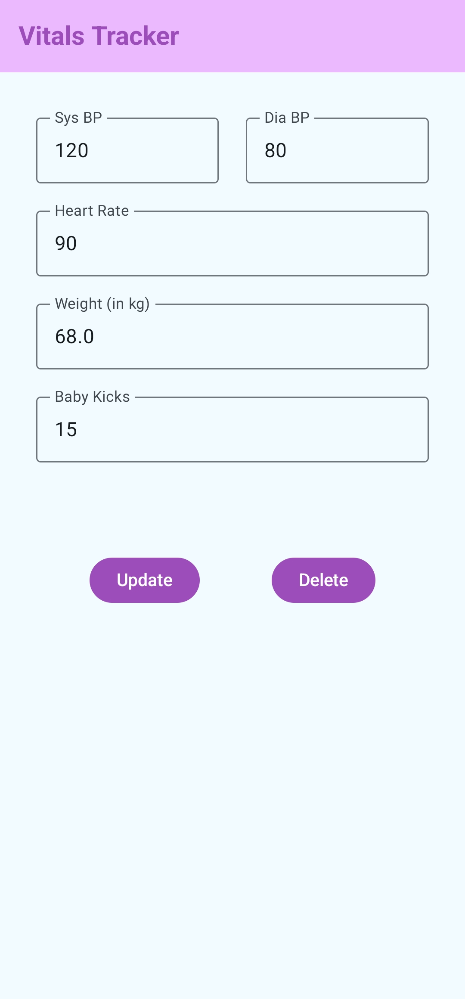

Markdown

# Vitals Tracker with Reminders

[](https://github.com/oneasad/vitalstracker/issues)
[](https://github.com/oneasad/vitalstracker/stargazers)
[](https://github.com/oneasad/vitalstracker/blob/main/LICENSE)
[](https://kotlinlang.org/)
[](https://developer.android.com/jetpack/compose)

Vitals Tracker is a modern Android application built with Jetpack Compose, designed to empower you to monitor and manage your vital health metrics effortlessly. Track your blood pressure, heart rate, weight, and even baby kicks with a clean, intuitive interface.

## ✨ Key Features

- **Comprehensive Tracking:**
  - Log your weight, kicks, blood pressure, heart rate and time.
- **User-Friendly Interface:** Built with Jetpack Compose for a smooth and responsive experience.
- **Clean Architecture:** Structured for maintainability and scalability, using a layered approach.
- **Offline Data Storage:** Utilizes Room database for reliable local data storage.
- **Modern UI:** Implemented with Material3 for a contemporary and consistent design.

## 🚀 Technologies Used

- **Kotlin:** The expressive and concise language for Android development.
- **Jetpack Compose:** Android's modern toolkit for building native UI.
- **ViewModel:** Manages UI-related data with lifecycle awareness.
- **StateFlow:** Reactive streams for managing and observing state changes.
- **Jetpack compose Navigation:** Modern and latest way of navigation with jetpack compose.
- **Koin dependency Management:** Management and dependency injection by koin.
- **Room Persistence Library:** For robust and efficient local data storage.

## 🏗️ Clean Architecture

This project adheres to Clean Architecture principles, ensuring a separation of concerns and maintainability:

- **Presentation Layer:** Contains UI components, ViewModels, and UI logic.
- **Data Layer:** Handles data retrieval and storage, including repositories and data sources.

## 📂 Project Structure

```
app/
├── src/
│ ├── main/
│ │ ├── java/com/oneasad/vitalstracker/
│ │ │ ├── data/ # Data layer: Models, repositories, data sources
│ │ │ │ ├── local/VitalsDao.kt
│ │ │ │ ├── local/VitalsDatabase.kt
│ │ │ │ ├── model/Vital.kt
│ │ │ │ ├── repository/VitalsRepository.kt
│ │ │ ├── di/AppModule
│ │ │ ├── presentation/ # Presentation layer: UI, ViewModels
│ │ │ │ ├── screens/VitalsInputScreen.kt
│ │ │ │ ├── screens/VitalsLogScreen.kt
│ │ │ │ | ├── screens/components/VitalsAlertDialog.kt
│ │ │ │ | ├── screens/components/VitalsCard.kt
│ │ │ │ ├── viewmodel/VitalsViewModel.kt
│ │ │ │ ├── worker/VitalsReminderWorker.kt
│ │ │ ├── utils/ # Utility classes and extensions
│ │ │ ├── utils/DateConverter.kt
├── screenshots/ # Screenshots of the application

```

## 📸 Screenshots





## 🏁 Getting Started

To use this app directly on your phone, download the app-debug.apk file ( located in the main directory ) and install in your android phone.
OR
Follow these steps to run the project locally:

1.  **Clone the repository:**

    ```bash
    git clone [https://github.com/oneasad/vitalstracker.git](https://github.com/oneasad/vitalstracker.git)
    ```

2.  **Open the project in Android Studio:**

    - Navigate to `File` -> `Open...` and select the cloned project directory.

3.  **Build and run:**
    - Connect an Android emulator or a physical device.
    - Click the "Run" button in Android Studio.

## 🤝 Contributing

Contributions are welcome! Here's how you can contribute:

1.  **Fork the repository.**
2.  **Create a new branch** for your feature or bug fix: `git checkout -b feature/your-feature-name`.
3.  **Commit your changes:** `git commit -m 'Add some feature'`.
4.  **Push to the branch:** `git push origin feature/your-feature-name`.
5.  **Open a pull request** on GitHub.

## 📝 Purpose

This project was developed as an internship test task for Janitri Innovations Pvt. Ltd.

## 📬 Contact

Feel free to reach me out with any questions or suggestions:

[Muhammad Asad Bashir](https://www.linkedin.com/in/oneasad) - mabofficial33@gmail.com
